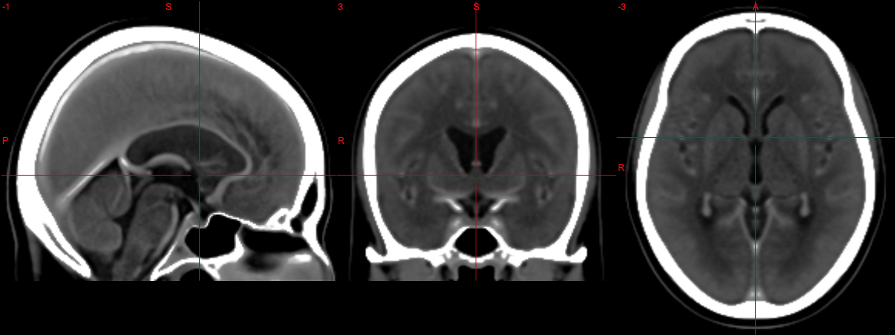

# Brain Imaging Accessoires: Fully automatic tilting of brainscans to ACPC (fatbACPC)

Everyday CT or MR examinations are supposed to be acquired in the same fashion, but slight deviations (e.g. due to subject/patient movement, differences in planning standards for MR and CT, or improper planning) may result in not easily comparable images. The fully automatic tilting of brainscans to Anterior Commissure - Posterior Commissure (fatbACPC) tool is meant to align CT and MR scans to the [ACPC](https://radiopaedia.org/articles/anterior-commissure-posterior-commissure-line) line to yield easily comparable images.

fatbACPC is meant to be used as a submodule of [BrainSTEM](https://github.com/BrainImAccs/BrainSTEM).

Please note, this software is research-only and must not be used for clinical decisions/diagnosis.

# Details

The fatbACPC script takes a directory with DICOM files of a CT or (3D) MR brain scan as input and then aligns that scan with a reference volume, such as the MNI brain atlas.

The [Anterior Commissure - Posterior Commissure (ACPC) line](https://radiopaedia.org/articles/anterior-commissure-posterior-commissure-line) has been adopted as a standard in neuroimaging as a reference plane for axial imaging. Most atlases are aligned with the ACPC line and therefore this script should yield image volumes aligned to the ACPC line. Hence the name of the script.




The ACPC line is similar to the orbitomeatal line used as a common reference plane in CT, which is about 9° steeper than the ACPC line. Aligning both CT and MR scans to the ACPC line should yield image volumes, which are easily comparable longitudinally and between modalities.

Especially interesting for CT scans is the option to automatically generate mean slabs. By default, mean slabs of 5 mm thickness are generated for CT scans. When generating the slabs, an algorithm finds the top non-air slice in the volume and starts the creation of slabs with that slice.

A simple check for a mis-registration is in place. If rotation around one axis is more than 45°, we assume a mis-registration happened and try to realign the image volume after skull stripping. FSL's skull stripping might introduce it's own set of artifacts in CT, therefore, we apply it as "rescue attempt" only.

The aligned scans will be automatically exported back to the PACS.

Options to `fatbACPC.bash`:

```
 -i --input [arg]    Directory containing the DICOM input files. Required.
 -k --keep-workdir   After running, copy the temporary work directory into the input directory.
 -c --cleanup        After running, empty the source directory (reference DICOM, translation matrices and logs are kept).
 -t --total-cleanup  After running, delete the source directory.
 -n --no-pacs        Do not send the results to the PACS.
 -v                  Enable verbose mode, print script as it is executed.
 -d --debug          Enables debug mode.
 -h --help           This page.
```

# Installation

We recommend installing fatbACPC using Docker. The container will expose a DICOM listener, which will accept brain images.

The results will be sent back to a DICOM node. For testing, you can for example use [Horos](https://horosproject.org) (on a Mac) to send and receive DICOM files.

fatbACPC will be made available on the Docker Hub soon. Currently, please download the Dockerfile and then build the image:

```bash
$ docker build -t fatbacpc ./
```

# Running

Environment variables may be used to configure aspects of BrainSTEM and fatbACPC (please see (`setup.(brainstem|fatbACPC).bash`) and BrainSTEM's `tools/startJob.bash-template`. For example, to have the results sent back to IP `192.168.0.27`, port `11112` (AE Title `destination`), you may execute the container as follows:

```bash
$ docker run -it \
	-p 10104:10104/tcp \
	--env called_aetitle=destination \
	--env peer=192.168.0.27 \
	--env port=11112 \
	fatbacpc
```

In the following example, 6 jobs may be processed in parallel, and the reference DICOM file, transformation matrices and logs are stored outside the container:

```bash
$ docker run -d --rm \
  -p 10104:10104/tcp \
  --env called_aetitle=destination \
  --env peer=192.168.0.27 \
  --env port=11112 \
  --env jobSlots=6 \
  --env BIA_CLEANUP=1 \
  --env BIA_KEEP_WORKDIR=0 \
  --env BIA_DEBUG=1 \
  --env BIA_WRITE_LOG=1 \
  --mount type=tmpfs,destination=/opt/BrainSTEM/incoming/data,tmpfs-mode=1777 \
  --mount type=bind,source=/mnt/docker/fatbACPC,destination=/opt/BrainSTEM/received/data/ \
  fatbacpc
```

The DICOM node in the container listens on port `10104/tcp` by default.

# Development

If you would like to pull either fatbACPC or BrainSTEM from a different GitHub account, or would like to us a different branch, you may use `--build-arg` when building the cointainer:

```bash
$ docker build \
  -t fatbacpc \
  --build-arg BIA_GITHUB_USER_BRAINSTEM=user \
  --build-arg BIA_BRANCH_BRAINSTEM=BrainSTEM-branch \
  --build-arg BIA_GITHUB_USER_MODULE=user \
  --build-arg BIA_BRANCH_MODULE=fatbACPC-branch \
  ./
```

# Acknowledgements

Please see [templates/README.md](https://github.com/brainimaccs/fatbACPC/blob/master/templates/README.md) for information on the templates.

The main scripts are based on the [BASH3 Boilerplate](http://bash3boilerplate.sh).
